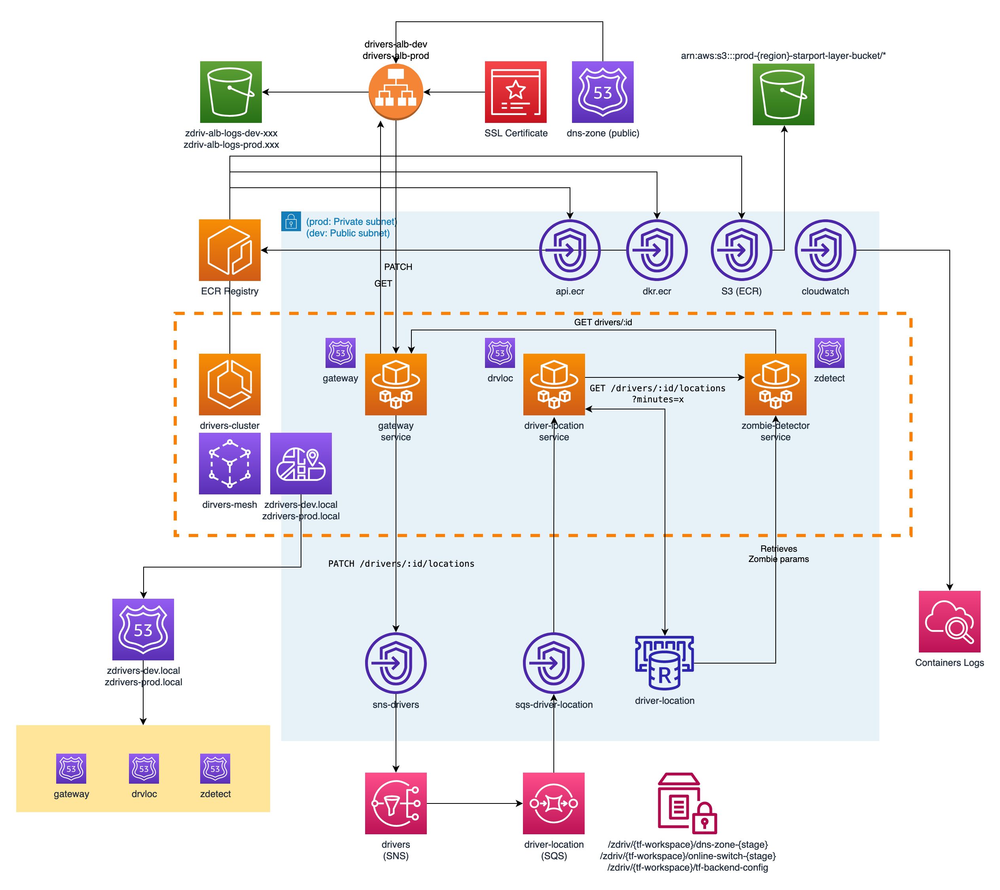

# zombie-drivers-node-aws <!-- omit in toc --> 
Zombie drivers take over AWS with a set of microservices written in Node.js!

- [1. Overview](#1-overview)
  - [1.1. Description](#11-description)
  - [1.2 Architectural diagram](#12-architectural-diagram)

# 1. Overview
## 1.1. Description
This is a revisited version of [my repo](https://github.com/silvestriluca/zombie-drivers) with the following differences:
- Code is ported from Go to modern NodeJS (v16)
- Services are meant to de deployed within AWS and use some of their services

## 1.2 Architectural diagram
